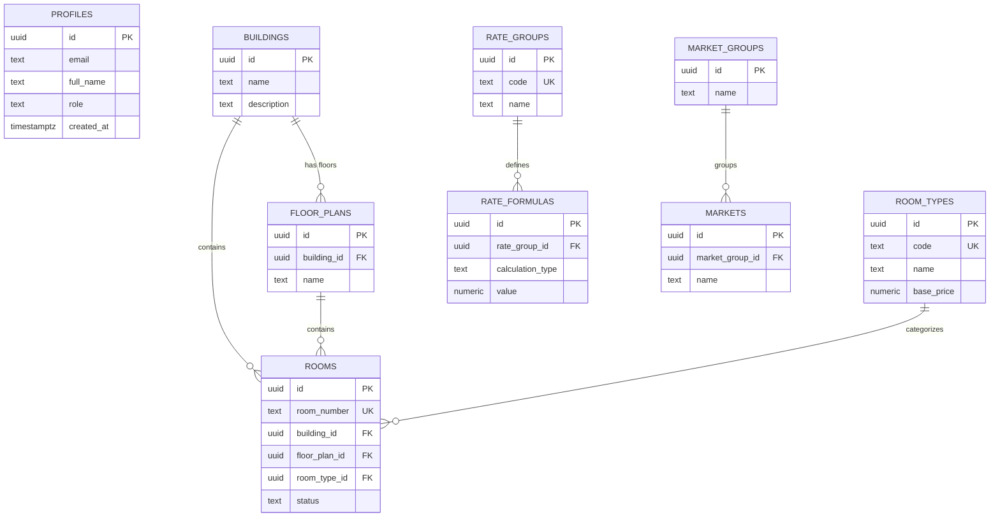

# ER Diagram — Hotel PMS Database

## Overview

The database follows a **normalized relational design** with 20 tables organized into 6 domains.

## Entity Relationship Diagram

## Domain Groups

### Property Domain
| Table | Description | Relations |
|-------|-------------|-----------|
| `buildings` | Physical hotel structures | Parent of floor_plans, rooms |
| `floor_plans` | Floors within buildings | FK → buildings |
| `room_types` | Room categories with pricing | Referenced by rooms |
| `rooms` | Individual room inventory | FK → buildings, floor_plans, room_types |

### Rates Domain
| Table | Description | Relations |
|-------|-------------|-----------|
| `rate_groups` | Rate categories (Rack, Corporate, etc.) | Parent of rate_formulas |
| `rate_formulas` | Calculation rules per rate group | FK → rate_groups |

### Market Domain
| Table | Description | Relations |
|-------|-------------|-----------|
| `market_groups` | Market segment categories | Parent of markets |
| `markets` | Individual market segments | FK → market_groups |

### Guest Domain (standalone)
`guest_types`, `nationalities`, `passport_types`, `visa_types`

### Booking Domain (standalone)
`booking_sources`, `channels`

### Operations Domain (standalone)
`departments`, `user_groups`, `special_services`, `folio_groups`, `zone_codes`

---

## Database Indexing Recommendations

| Index | Table.Column | Purpose |
|-------|-------------|---------|
| `idx_profiles_role` | profiles.role | Role-based query filtering |
| `idx_profiles_email` | profiles.email | Login lookups |
| `idx_rooms_status` | rooms.status | Dashboard KPI queries |
| `idx_rooms_building_id` | rooms.building_id | Building-scoped room lists |
| `idx_rooms_room_type_id` | rooms.room_type_id | Type-based filtering |
| `idx_rooms_floor_plan_id` | rooms.floor_plan_id | Floor-based views |
| `idx_room_types_code` | room_types.code | Code lookup (unique) |
| `idx_floor_plans_building_id` | floor_plans.building_id | Building floors |
| `idx_rate_formulas_rate_group_id` | rate_formulas.rate_group_id | Rate calculations |
| `idx_markets_market_group_id` | markets.market_group_id | Market queries |
| `idx_nationalities_country_code` | nationalities.country_code | Country lookups |

**Future indexes** (add when booking/reservation tables are introduced):
- Composite index on `(building_id, status)` for availability queries
- Index on reservation date ranges for occupancy reports
